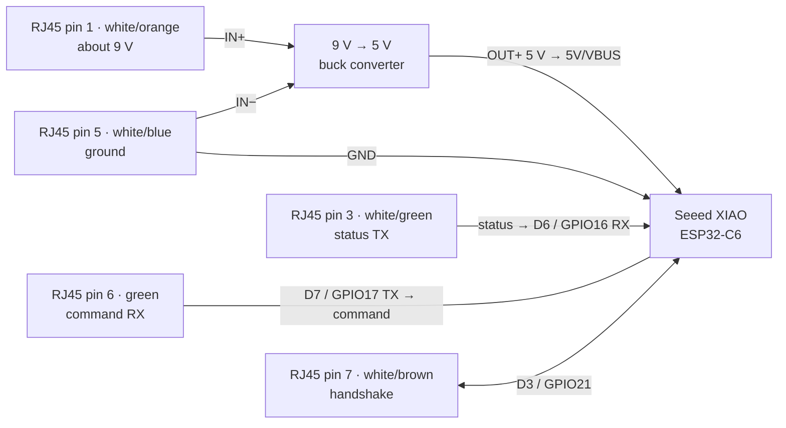
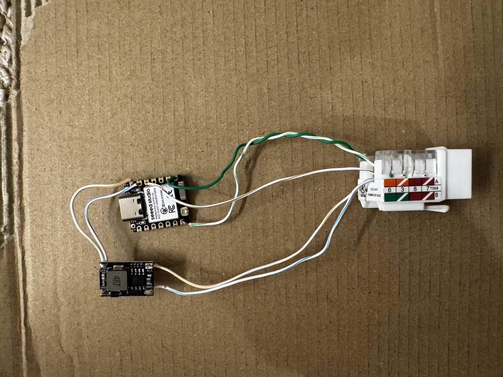

# Delta Touch2O Matter controller

This firmware lets a Seeed Studio XIAO ESP32-C6 replace the Delta VoiceIQ
module. It connects to the Touch2O solenoid's RJ45-shaped cable and exposes the
faucet as a Matter on/off accessory.

Matter On and Off control the valve. Touching the faucet or operating its
handle still works normally, and the reported Matter state follows the
Touch2O's actual valve-status messages.

The Matter standard has a Water Valve device type, but Apple Home does not
currently support it. This project advertises the faucet as an on/off plug-in
unit so Apple Home can pair and control it.

## Parts

* Seeed Studio XIAO ESP32-C6
* 9 V-to-5 V buck converter
* Female 8P8C/RJ45 breakout
* Insulated wire, heat-shrink, and an enclosure
* Multimeter

## Power safety

The Touch2O cable is not Ethernet. Do not connect it to a switch, injector, or
other network equipment.

> [!WARNING]
> **Do not connect USB-C to your computer while the buck converter is connected
> to the XIAO `5V/VBUS` pin.** Use one power source at a time. Disconnect USB-C
> before powering the XIAO from the Touch2O cable.

Use USB-C only to flash the XIAO and record its Matter pairing code.

## Wiring

This table uses T568B cable colors. Confirm the breakout's numbered pins and
your meter readings before connecting the faucet.

| RJ45 pin | T568B color | Connection |
| ---: | --- | --- |
| 1 | White/orange | Buck `IN+` — about 9 V from the Touch2O solenoid |
| 2 | Orange | No connection; individually insulate |
| 3 | White/green | XIAO D6 / GPIO16 (`UART1 RX`) |
| 4 | Blue | No connection; individually insulate |
| 5 | White/blue | Buck `IN−`, buck `OUT−`, and XIAO `GND` |
| 6 | Green | XIAO D7 / GPIO17 (`UART1 TX`) |
| 7 | White/brown | XIAO D3 / GPIO21 (handshake) |
| 8 | Brown | No connection; individually insulate |

Connect the buck converter's regulated `OUT+` to XIAO `5V/VBUS`. Never connect
it to `3V3`.



## Build photo



## Build and flash

Install ESP-IDF 6.x and ESP-Matter, then run:

```sh
git clone git@github.com:evantobin/VoiceIQMatter.git
cd VoiceIQMatter
. ./env.sh
idf.py build
idf.py -p /dev/cu.usbmodemXXXX flash
idf.py -p /dev/cu.usbmodemXXXX monitor
```

`env.sh` defaults to ESP-IDF at `~/.espressif/v6.0.2/esp-idf` and ESP-Matter
at `~/esp/esp-matter`. Set `ESP_IDF_EXPORT` or `ESP_MATTER_PATH` first if your
installations are elsewhere.

## Project settings

All normal settings are in `project_config.cmake`. This includes the Matter
passcode and discriminator, `voiceiqmatter.local` hostname, Wi-Fi versus Thread,
HTTP debugging, UART pins, timings, and Matter device names.

### Choose Wi-Fi or Thread

Open `project_config.cmake` and change `VOICEIQ_MATTER_TRANSPORT` to one of
these values:

```cmake
# Matter over Wi-Fi
set(VOICEIQ_MATTER_TRANSPORT "wifi")
```

```cmake
# Matter over Thread
set(VOICEIQ_MATTER_TRANSPORT "thread")
```

Matter is always enabled. Wi-Fi mode supports the browser log at
`voiceiqmatter.local`. Thread mode completely disables the HTTP log server,
even if `VOICEIQ_ENABLE_HTTP_DEBUG` is `ON`.

For a Wi-Fi build, choose whether the browser log runs:

```cmake
set(VOICEIQ_ENABLE_HTTP_DEBUG ON)  # Run the HTTP log server
set(VOICEIQ_ENABLE_HTTP_DEBUG OFF) # Do not build or start the HTTP log server
```

After changing either setting, make a clean build:

```sh
idf.py fullclean
idf.py build
```

## First boot and Matter pairing

1. Leave the Touch2O cable and buck disconnected. Flash the XIAO over USB-C.
2. Record the Matter manual pairing code or QR-code URL from the serial monitor.
3. Disconnect USB-C.
4. Wire the buck and RJ45 breakout. Confirm the buck output is 5 V.
5. Connect the Touch2O cable to power the controller.
6. Add the device to your Matter controller with the saved pairing code.

## Debug log

When Wi-Fi transport and HTTP debugging are enabled, open
`http://voiceiqmatter.local/` on your local network. You can use
`http://<device-ip>/` as a fallback.
It shows a live RAM-only Touch2O UART log containing sent commands, heartbeats,
and valve status. Every byte received from the Touch2O status wire is shown as
`RX raw` in hexadecimal. Complete status frames are also labeled as `valve
open`, `valve closed`, or `unknown`. This keeps unexpected or partial messages
visible while the status and temperature data are identified. The page has no
authentication, so do not expose it outside your LAN.

## Protocol implemented

The controller listens for faucet status as soon as it starts, but it does not
send handshakes, heartbeats, or valve commands until Matter commissioning has
completed. On later boots, a saved Matter fabric enables protocol traffic after
the Matter stack starts.

The local interface is 9600 baud, 8N1 with the handshake on RJ45 pin 7.

| Purpose | Frame |
| --- | --- |
| Heartbeat | `AA 06 09 00 00 15 00 00 FF 67` |
| Open valve | `AA 06 82 02 00 15 00 00 FE 34` |
| Close valve | `AA 06 82 00 00 15 00 00 7D 70` |
| Valve open status | `AA 03 82 02 00 42 D5` |
| Valve closed status | `AA 03 82 00 00 20 B3` |

Water temperature is not implemented because it is not provided by the
documented Touch2O serial messages.

## Sources

* [Touch2O pinout and reference sketch](https://community.hubitat.com/t/delta-voiceiq-integration-killed/158256/33)
* [Protocol confirmation](https://community.hubitat.com/t/delta-voiceiq-integration-v1-killed-v2-still-alive/158256)
